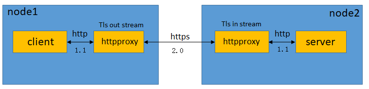

# httpproxy

- http client request proxy tools

## build
```
go build .
```

## usage

```
Usage of httpproxy.exe:
  -ca string
        CA certificate to verify peer against.
  -cert string
        certificate file.if [-tls] option been seted, this required.
  -debug
        debug mode.
  -h    this help.
  -in string
        listen addr for http/https proxy.
  -key string
        private key file name.if [-tls] option been seted, this required.
  -out string
        redirect to addr for http/https proxy.
  -time int
        http proxy run time.
  -tls string
        the proxy channel enable https.[in/out]
```

## example

- forward proxy

```
httpproxy.exe -in 127.0.0.1:8080 -out "10.10.0.1:8080;10.10.0.2:8080"
```

- Reverse Proxy

```
httpproxy.exe -in :8080 -out "127.0.0.1:8080;127.0.0.2:8080"
```

## Tls (default http2.0)


- TLS out stream example:

```
httpproxy.exe -in 127.0.0.1:8081 -out node2-IP:8082 -tls out -ca .\cert\ca.crt -cert .\cert\client.crt -key .\cert\client.pem
```

- TLS in stream example:

```
httpproxy.exe -in :8082 -out server-IP -tls in -ca .\cert\ca.crt -cert .\cert\server.crt -key .\cert\server.pem
```

